# Preply

Lightweight Todolist + Note-Taking App build with React Native, backend powered by Google Firebase (Realtime Database). With features such as tag sorting system, data syncing, and other useful utilities built in into the app.

## Table of Contents

    <b>
        Click to expand
    </b>

- [Preply](#preply)
  - [Table of Contents](#table-of-contents)
  - [Todos](#todos)
      - [Features](#features)
    - [Sorting](#sorting)
    - [Filtering](#filtering)
  - [Notes](#notes)
  - [Utilities](#utilities)
    - [Calculator](#calculator)
    - [Unit Converter](#unit-converter)
  - [Account](#account)
    - [Merge Options](#merge-options)
      - [Option I - (Local overwrites cloud)](#option-i---local-overwrites-cloud)
      - [Option II - (Cloud overwrites local)](#option-ii---cloud-overwrites-local)
      - [Option III - (Compare and merge)](#option-iii---compare-and-merge)

## Todos

|                        Todos                         |                     Todo Input                      |                        Date Picker                         |                        Time Picker                         |
| :--------------------------------------------------: | :-------------------------------------------------: | :--------------------------------------------------------: | :--------------------------------------------------------: |
| 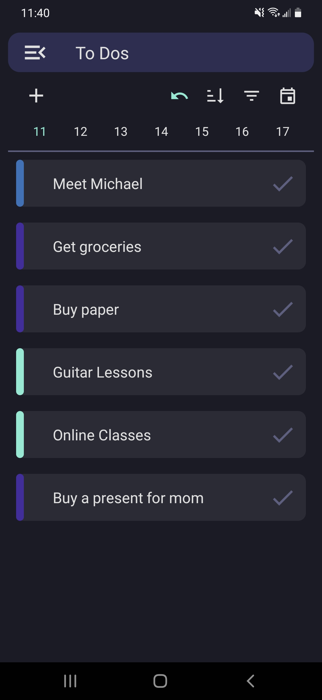 | 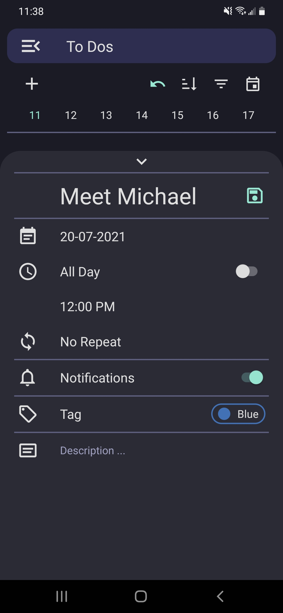 | 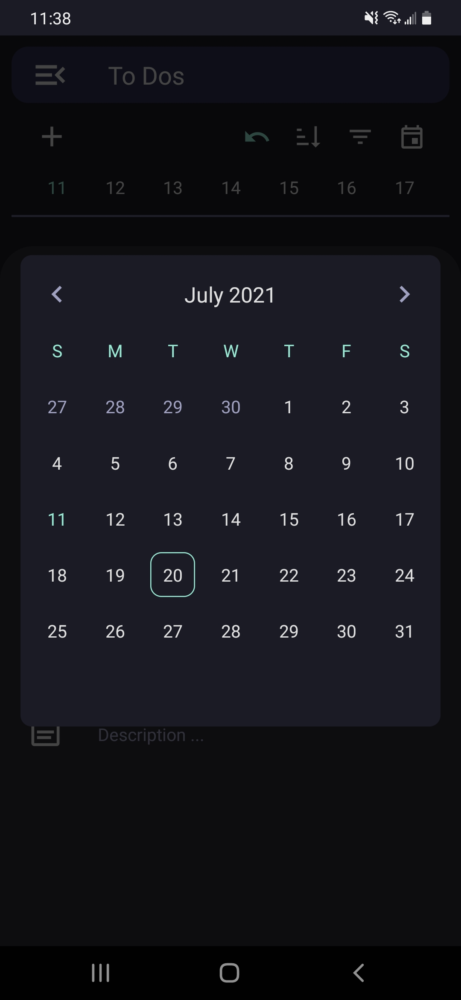 | 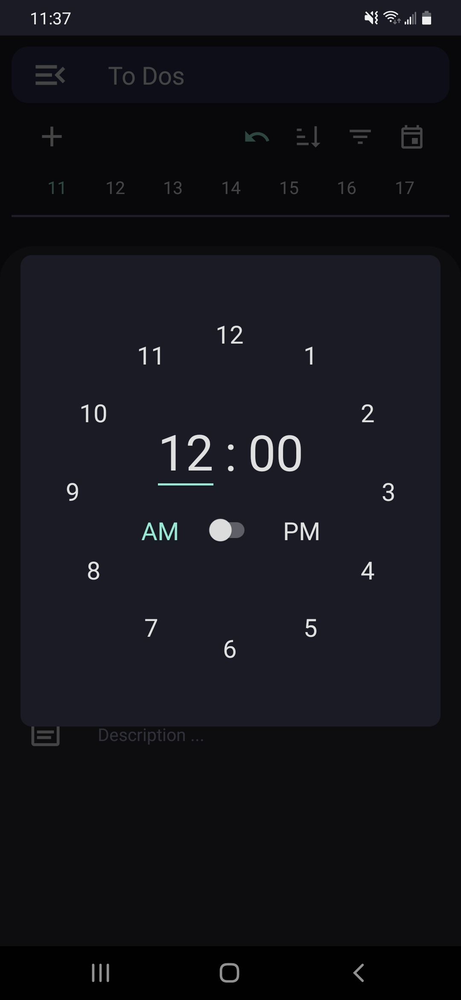 |

Simple Todo taking mode with features for sorting, filtering, and more.

#### Features

- Tagging
  - Allows users to categorize their todos, which can be filtered and sorted
- Notification Reminders
  - Ability to schedule notifications to fire before the set time of the task
- Recurring Todos
  - Scheduled notifications can be recurring, repeating either daily, weekly, or monthly.

### Sorting

<table>
    <tr>
        <td valign='top' width='210' height='351'>
            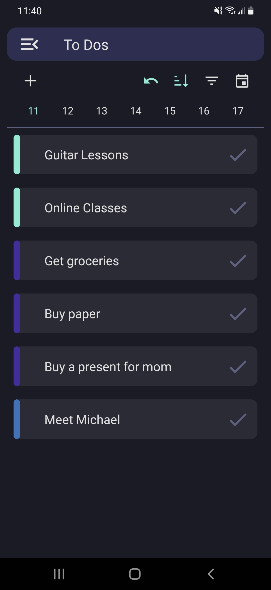
        </td>
        <td valign='top'>
            The default order of display is chronological, if sort mode is on, the order of todo records will be sorted to the default tag order, which is arranaged to the color of the tag category. Order of the tags can been seen below at the note section in the tag picker screenshot.
        </td>
    </tr>
</table>

### Filtering

<table>
    <tr>
        <td valign='top' width='210' height='351'>
            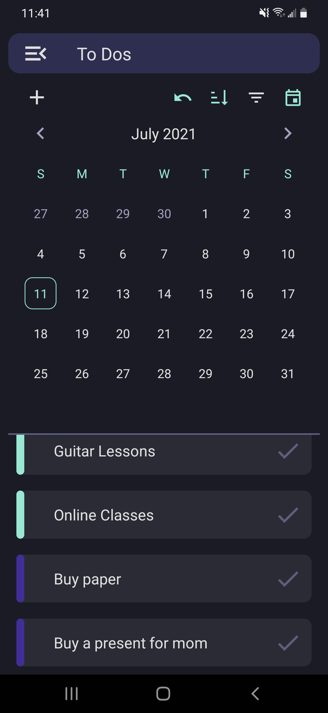
        </td>
        <td valign='top' width='210' height='351'>
            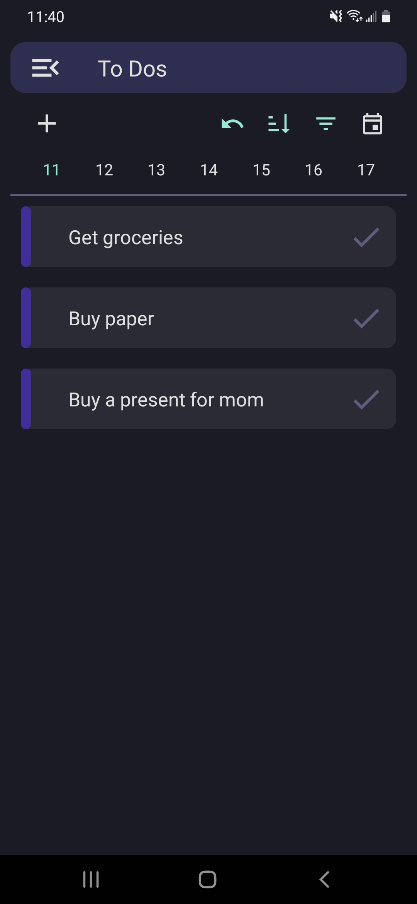
        </td>
        <td valign='top'>
            The default state does not filter any todo records, so all records are display initially. User's that wish the single out todos for a specific date can open the date picker and select the specific date of todos they want to view. The list will automatically filter out todos that do not land on the selected date.
        </td>
    </tr>
</table>

---

## Notes

|                        Notes                         |                      Note Page                      |                     Tag Picker                      |
| :--------------------------------------------------: | :-------------------------------------------------: | :-------------------------------------------------: |
| 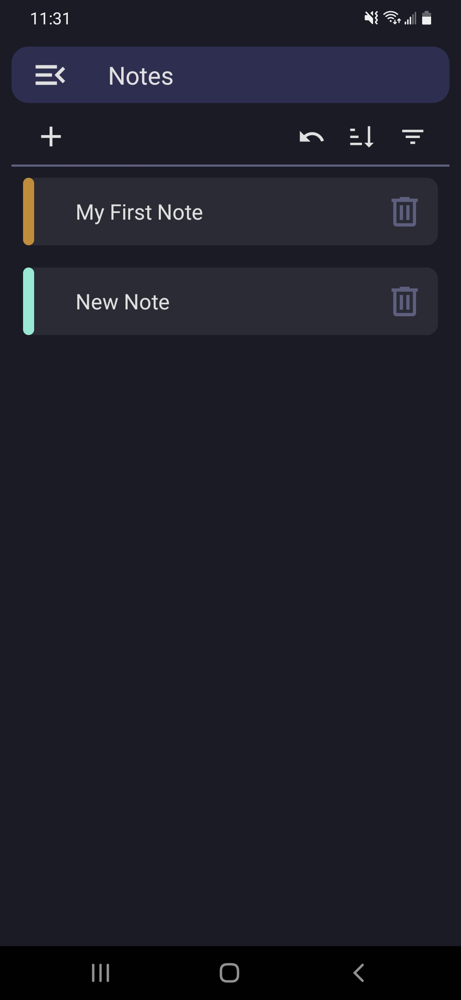 |  | 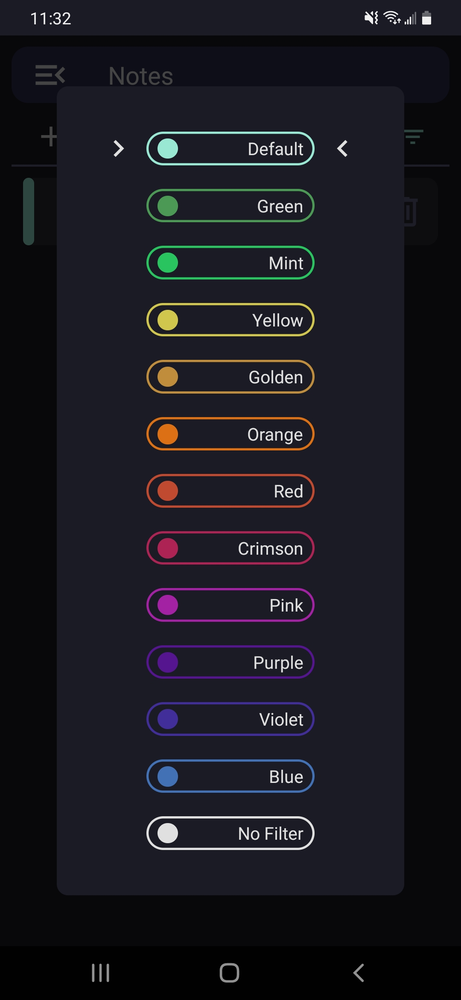 |

---

## Utilities

Apart from the two main functionalities, there are also two utility screens built in into the the app. A calculator and a unit converter to aid the user on their todo taking. On the chance of them needing to do a complex calculation or unit coversion, they can simply switch to these utility apps and compute the desired value.

### Calculator

<table>
    <tr>
        <td valign='top' width='210' height='351'>
            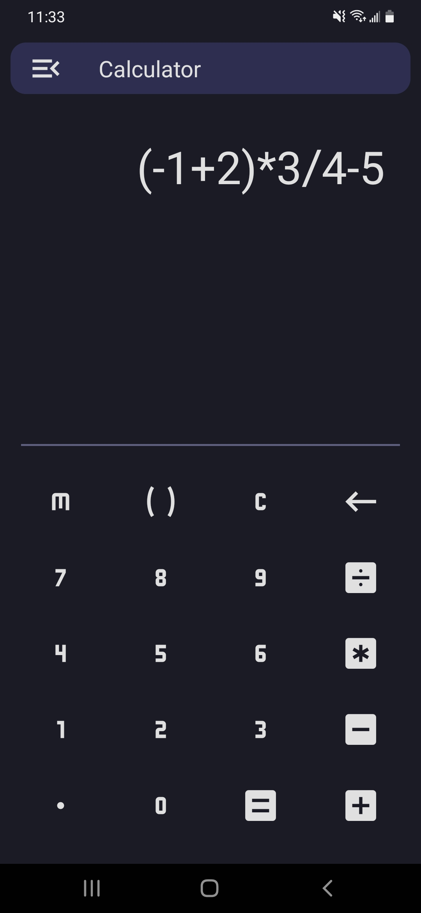
        </td>
        <td valign='top' width='210' height='351'>
            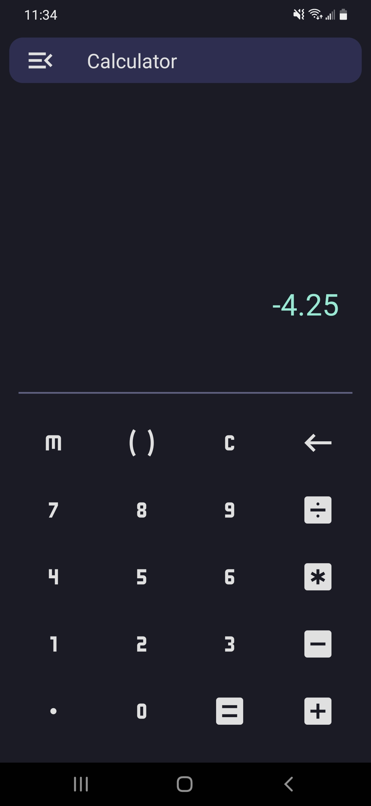
        </td>
        <td valign='top'>
            Simple implementation of a calculator, featuring basic arithmetic and parentheses.
             
             
            Another functionality is result saving. There is one result slot for saving and it automatically overwrites when a new result is computed.
        </td>
    </tr>
</table>

### Unit Converter

<table>
    <tr>
        <td valign='top' width='210' height='351'>
            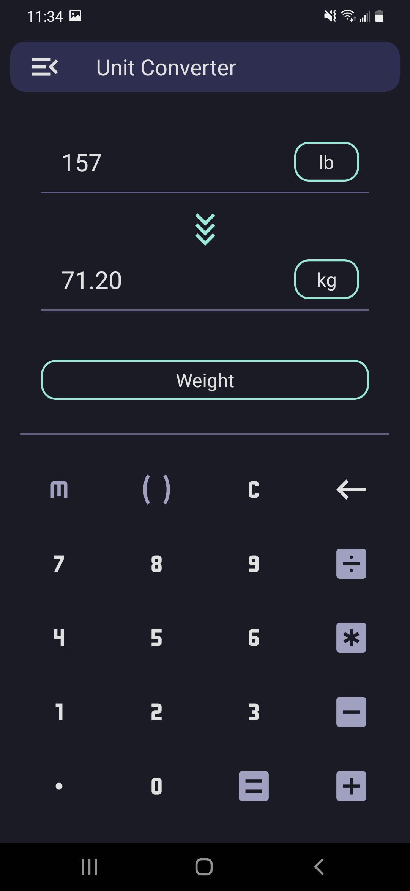
        </td>
        <td valign='top' width='210' height='351'>
            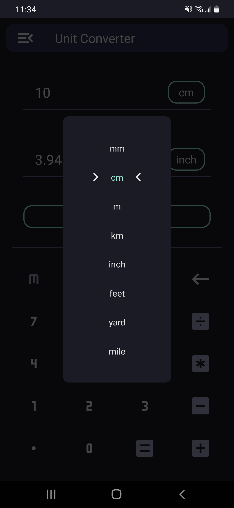
        </td>
        <td valign='top'>
            The unit coverter features three different unit categories
             
             
            > Distance
             
            > Mass
             
            > Temperature
             
             
            Each of these categories feature a few interchangable units for the user to choose. Simply select two units from the same category, input the value and the coversion will be automatically calculated.
        </td>
    </tr>
</table>

---

## Account

|                        Sign Up                        |                        Sign In                        |                      Reset Password                       |                     Managment                      |
| :---------------------------------------------------: | :---------------------------------------------------: | :-------------------------------------------------------: | :------------------------------------------------: |
| 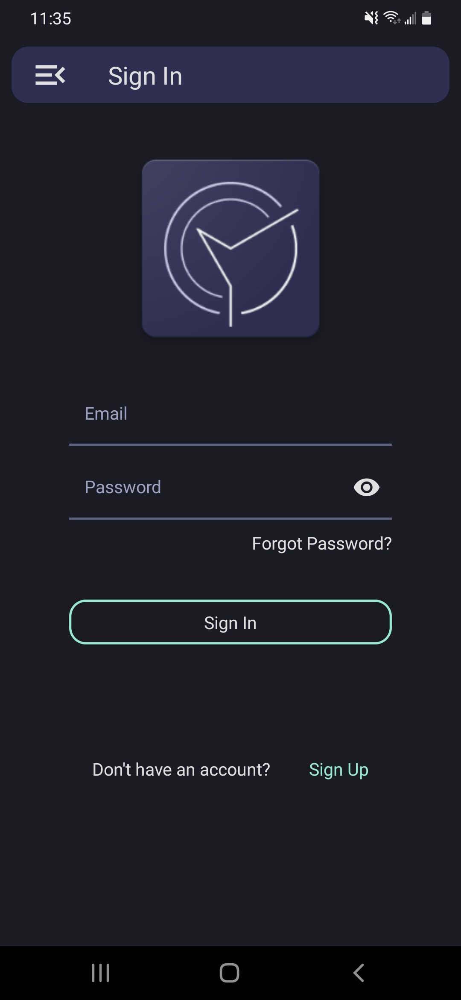 | 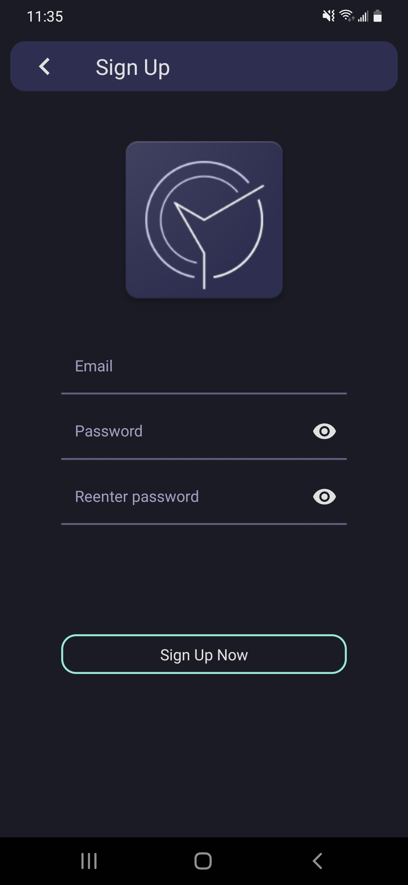 | 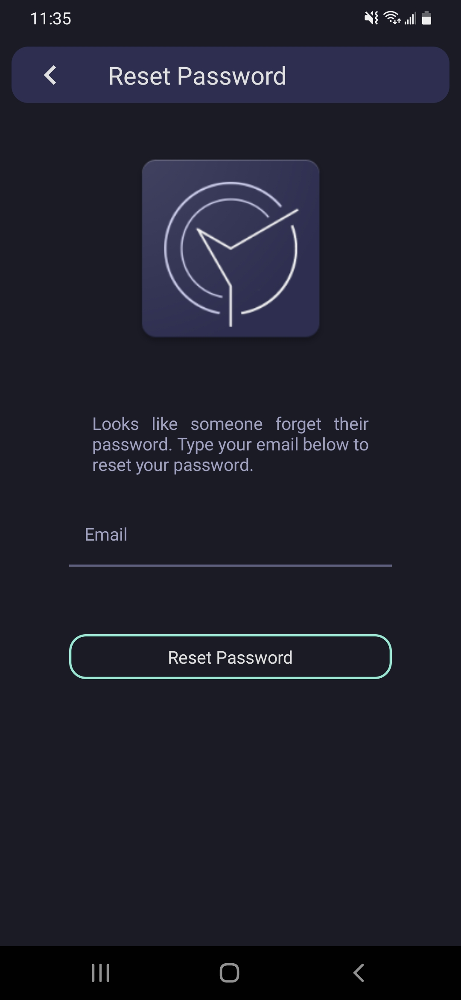 | 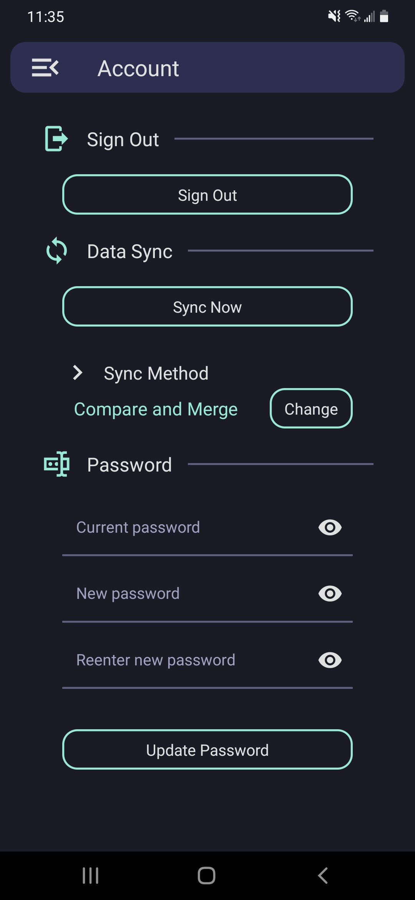 |

### Merge Options

#### Option I - (Local overwrites cloud)

- All cloud stored data will be wiped and whatever records is stored in the app will be uploaded to the cloud storage

#### Option II - (Cloud overwrites local)

- All local data will be wiped and whatever is stored on the cloud will be dowloaded and loaded into the local store

#### Option III - (Compare and merge)

- The last modified dates of each record (from cloud and local store) will be compared, and the latest modified will take presences
- The compared and merged result will overwite both local and cloud stores

