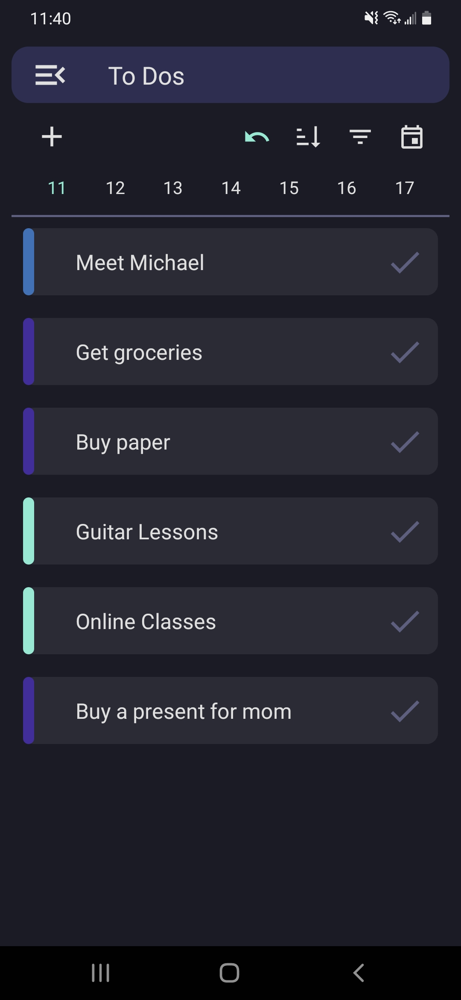
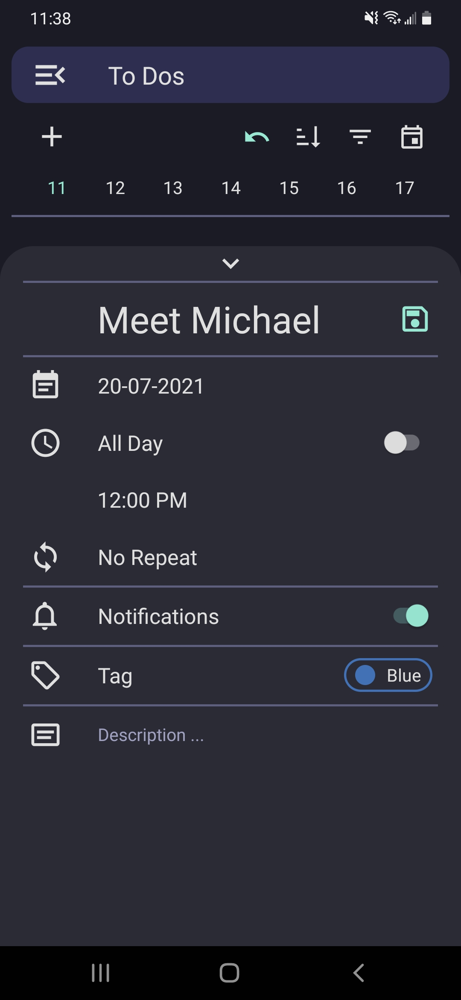
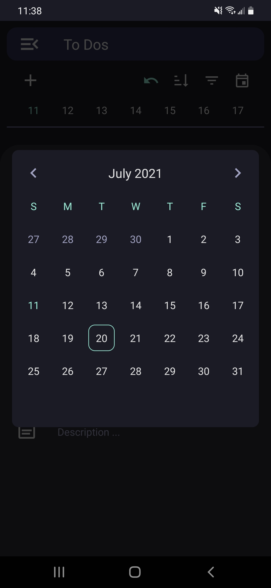
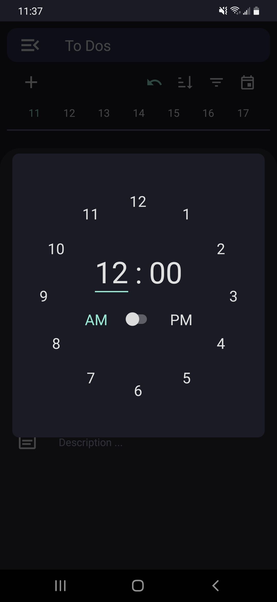

# Preply [(Github)](https://github.com/lochungtin/Preply)

Lightweight Todolist + Note-Taking App build with React Native, backend powered by Google Firebase (Realtime Database). With features such as tag sorting system, data syncing, and other useful utilities built in into the app.

## Basics

|                        Todos                         |                     Todo Input                      |                        Date Picker                         |                        Time Picker                         |
| :--------------------------------------------------: | :-------------------------------------------------: | :--------------------------------------------------------: | :--------------------------------------------------------: |
|  |  |  |  |

### Features

- **Notification Reminders**
  - Ability to schedule notifications to fire before the set time of the task.
- **Recurring Todos**
  - Scheduled notifications can be recurring, repeating either daily, weekly, or monthly.

## Advanced Features

- **Note Sorting / Filtering**
  - Made possible by a tag feature for categorisation
- **Utilities**
  - Built-in calculator and unit converter
- **Account System**
  - Note syncing with remote database
